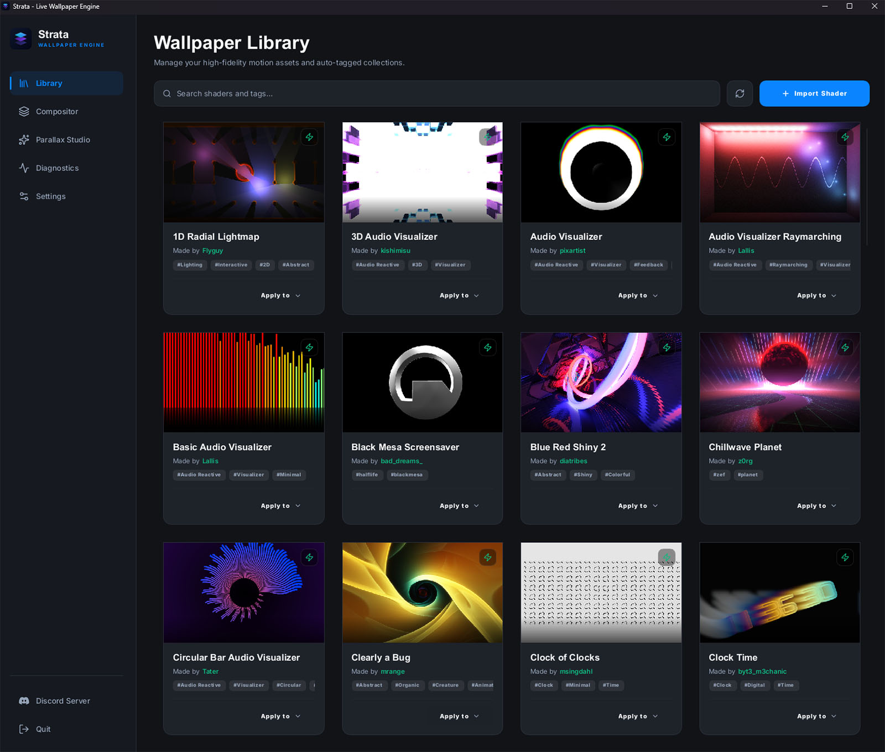
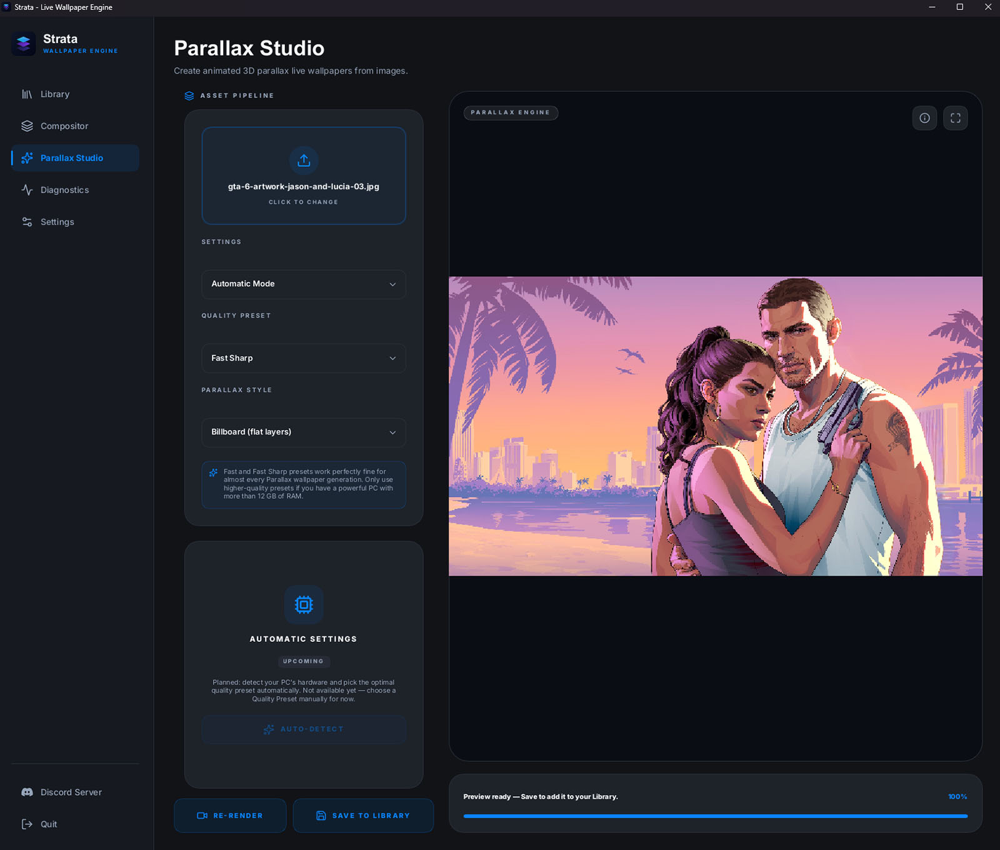

# 🌌 Strata

> A hyper-lightweight, hardware-accelerated, native cross-platform live wallpaper and screensaver engine built in Rust.

Strata bypasses the heavy resource footprints of traditional web-based wallpaper utilities by executing GLSL shaders directly on native graphics APIs (DirectX 12, Vulkan, and Metal) via `wgpu`. A decoupled rendering core paired with a native Slint configuration interface delivers fluid, audio-reactive, multi-monitor desktops at a fraction of the memory and CPU overhead. Strata ships with a curated selection of shaders ported from Shadertoy.com.





---

## ✨ Features

* **Shadertoy-compatible shader engine** — automatic preprocessing wraps standard Shadertoy GLSL into native pipelines, including `common.glsl` injection, the full standard uniform set (`iResolution`, `iTime`, `iMouse`, `iDate`, `iFrame`, …), and multipass buffers (A–D) with correct cross-referencing and previous-frame (ping-pong) semantics resolved automatically from each manifest.
* **Audio-reactive wallpapers** — on-demand WASAPI loopback capture (`cpal`) with FFT analysis streamed into a Shadertoy-style 512×2 spectrum/waveform texture. Capture only runs while an audio shader is on screen; sensitivity is user-tunable.
* **Mouse-interactive wallpapers** — OS-level cursor telemetry routed straight into shader uniforms, with a four-mode selector (Off / Everything / Only Shaders / Only Parallax Studio) and sensitivity control.
* **Parallax Studio (2.5D depth wallpapers)** — turn any photo into an animated 3-D parallax wallpaper. An on-demand ML pipeline (depth estimation → subject matting → LaMa inpainting → optional upscaling, via ONNX Runtime / DirectML, models fetched from Hugging Face) builds a layered scene that shifts with the cursor — or, when mouse interactivity is off, drifts gently on its own. Automatic (quality-preset) and Manual (per-knob) modes, with live re-tuning.
* **Shadertoy `.json` / `.zip` import** — import shaders exported by the Shadertoy browser plugin: the converter ports them to Strata's `manifest.toml` + `.glsl` format, maps texture/cubemap/buffer/audio channels (cubemaps fully supported), auto-rewrites the `mat2(vec4)` rotation idiom that naga miscompiles, generates a thumbnail, and flags incompatible shaders with a clear toast. Imported items carry a red badge and a delete option.
* **True multi-monitor compositing** — per-monitor wallpaper windows created and torn down on demand (no shader assigned = no window, the real desktop shows). Layer stacks per monitor with reordering, opacity, blend modes (normal/additive/multiply), positioning modes, and per-layer resolution scaling from 0.25× to 1.0×. Optional spanned mode treats multiple displays as one continuous canvas.
* **Wallpaper library** — scans local shader packages, tag-based search and filtering, safe import of Shadertoy exports and native `.zip` packs (zip-slip protected), per-creation delete for Parallax / imported wallpapers, clickable "Made by …" attribution links, and automatic thumbnail generation: missing previews are rendered headlessly (with synthetic audio for visualizers) and saved as `thumbnail.png` inside each self-contained pack.
* **Automatic update checks** — a weekly background check compares the running build against the latest GitHub release **and** the live asset-library version, surfacing a toast and a one-click "Download Update" in Settings when either is newer.
* **Native Slint UI** — dark/light/follow-system theming, system tray with theme-aware icons, close-to-tray, autostart that boots straight to the tray (no window pop-up on login), global render-quality (resolution-scale) preset, diagnostics dashboard (FPS, frame time, VRAM estimate), a live shader-compile log, and a Discord community link.
* **Robust by design** — panic-safe shader compilation with source-mapped, human-readable error messages (user line numbers, not preprocessed ones); GPU device-loss (TDR) detection with automatic recovery; configuration persisted as TOML in OS-correct per-user directories.

---

## ✨ Project Goals & Philosophy

* **Bare-Metal Performance:** Near-zero idle CPU (measured <1% while rendering two monitors at 60 FPS) and a memory footprint an order of magnitude below web-runtime alternatives.
* **On-Demand Everything:** No wallpaper window without an assigned shader, no audio capture without an audio shader on screen, no thumbnail work at startup. The app launches as light as possible so it never competes with other autostart software.
* **Strict Decoupling:** The rendering core is isolated from OS windowing, tray, lifecycle, and UI concerns, so desktop and mobile shells share one renderer instead of rewriting it.
* **Modular Layering:** Vertical composition of shader layers per monitor — backgrounds, audio-reactive layers, and overlays stack freely.
* **Zero-Latency Responsiveness:** Input telemetry and audio FFT data go straight to GPU uniform/texture bindings without intermediate serialization.

### Architecture Comparison

| Feature | Traditional Solutions (CEF / WebGL) | Strata (Rust / `wgpu`) |
| :--- | :--- | :--- |
| **Runtime Environment** | Embedded Chromium Instance (CEF) | Native compiled binary |
| **Graphics API** | WebGL browser abstraction | Bare-metal native (DX12 / Vulkan / Metal) |
| **Memory Footprint** | 400MB – 1.5GB+ | **~200MB** rendering two 1440p monitors, UI open |
| **Idle CPU** | Persistent browser overhead | **<1%**, fully on-demand resources |
| **Multi-Monitor** | Thread-isolated browser frames | Per-monitor native windows or one spanned coordinate space |
| **Audio Reactivity** | High latency (browser audio stack) | **Ultra-low** — OS loopback → FFT → GPU texture, captured only on demand |

---

## 🏗️ System Architecture

Strata is a Cargo workspace with two crates and a strict dependency direction:

* **`core-engine`** — a pure, OS-agnostic graphics library. Owns the `wgpu` instance/device/queue, the GLSL preprocessor and `naga`-based compiler (panic-safe, source-mapped errors), the manifest-driven multipass render graph (automatic ping-pong allocation only for buffers that read their previous frame), uniform state, the audio capture/FFT engine, and headless rendering for thumbnails. It has no dependency on Slint, Winit, tray, or any platform shell.
* **`platform-shells/strata-desktop`** — the native desktop host. Runs the Slint UI and event loop on the main thread; rendering, shader compilation, imports, scanning, and thumbnail generation run on background workers. Communicates with the renderer through typed Rust command channels (no IPC, no serialization). Windows integration (WorkerW desktop embedding, tray, autostart) lives here, behind modules that future Linux/macOS/Android/iOS shells replace without touching `core-engine`.

Each wallpaper is a self-contained package: a `manifest.toml` declaring pass order and channel bindings (textures, buffers, audio), the GLSL pass sources, an optional `common.glsl` injected into every pass, and optional static assets.

---

## 🔄 Shader Ingestion & Multi-Pass Pipeline

Strata achieves parity with Shadertoy's multi-buffer ecosystem natively in wgpu through a strict package format and an automated pipeline constructor.

### 1. Global Uniform Bindings

Standard inputs are managed by the engine globally. A single struct is updated every frame via `queue.write_buffer()` and bound identically across every render pass, requiring zero per-shader configuration:

| Uniform | Description |
| :--- | :--- |
| `iResolution` | Viewport size in pixels |
| `iTime` / `iTimeDelta` | Playback time / Render time |
| `iMouse` | OS-level mouse coordinate telemetry |
| `iDate` / `iFrame` / `iSampleRate` | Date, frame count, and sample rate |

### 2. The `manifest.toml` Blueprint

Each wallpaper includes a manifest dictating the render pass sequence and mapping local media, buffers, and the audio stream to `iChannel` slots. The engine analyzes the pass graph itself: any buffer read at its previous-frame state (self-feedback or read-before-produce) is automatically double-buffered; everything else gets a single render target.

```toml
[wallpaper]
name = "Cosmic Vortex"
author = "Developer"
version = "1.0.0"
tags = ["Audio Reactive", "3D", "Visualizer"]

# Execution order matters! Left-to-right processing.
passes = ["buffer_a", "buffer_b", "image"]

[render_targets.buffer_a]
source = "buffer_a.glsl"
bindings = [
    { channel = 0, type = "texture", path = "noise.png" },
    { channel = 1, type = "buffer", target = "buffer_a" } # Feedback loop — auto ping-ponged
]

[render_targets.buffer_b]
source = "buffer_b.glsl"
bindings = [
    { channel = 0, type = "buffer", target = "buffer_a" }
]

[render_targets.image]
source = "image.glsl"
bindings = [
    { channel = 0, type = "buffer", target = "buffer_b" },
    { channel = 1, type = "audio", stream = "system_default" }
]
```

### 3. `common.glsl` Injection

To replicate Shadertoy's globally accessible Common tab, the shader loader automatically prepends the contents of `common.glsl` into every pass (right after the engine's uniform definitions) before compilation — and the error mapper accounts for it, so compile errors still report the author's original line numbers.

---

## 💻 Supported Platforms

| Platform | Status |
| :--- | :--- |
| Windows | [x] **Supported** |
| Linux | [ ] Planned — next up |
| Android | [ ] Planned |
| macOS | [ ] Planned |
| iOS | [ ] Planned |

---

## 🗺️ To-do-list

Graphics foundation, advanced composition, parallax modue, and the native Slint shell are complete and shipped in the current Windows build.

- [ ] **Game/Intensive-app auto-pause:** Detect when a fullscreen game or other GPU/CPU-heavy app is in the foreground and automatically pause shader rendering (resuming when it exits) so Strata never competes for resources during play.
- [ ] **Daily wallpaper curation:** An opt-in mode that automatically rotates the active wallpaper(s) each day, randomly picking from the library (or a user-chosen subset) for a fresh desktop every morning.
- [ ] **Parallax auto-detect:** Detect the user's hardware (GPU class, RAM) and automatically pick the optimal Parallax Studio quality preset, so the "Auto-Detect" button in Automatic mode becomes functional.
- [ ] **Asset Library:** An exclusive repository hosting wgpu-patched shaders, Parallax module presets and model lists.
- [ ] **Translation Support:** Build on the existing i18n-ready string organization to ship actual multi-language support in the Slint UI.
- [ ] **Screensaver Mode:** Reuse the renderer as a native screensaver target, fulfilling the engine's dual wallpaper/screensaver mandate.
- [ ] **Distribution Polish:** Installer/packaged build for Windows with sensible defaults (autostart opt-in, per-user data dirs).
- [ ] **Async Telemetry Routing:** A background `reqwest`-based system for querying live web APIs without touching the render loop.
- [ ] **Spotify "Now Playing":** OAuth integration surfacing track metadata and artwork as dynamic textures inside active shaders (UI placeholder already exists).
- [ ] **Linux:** Wayland `wlr-layer-shell` (and X11 fallback) desktop integration, reusing the Slint configuration shell.
- [ ] **Android:** Native package (`com.strata.engine`) binding the renderer into Android's `WallpaperService` via the NDK, with platform-correct lifecycle, surfaces, and storage.
- [ ] **macOS:** Desktop-behind-icons integration for macOS spaces, menu-bar/tray equivalents, and app-bundle packaging.
- [ ] **iOS:** Host with Metal-compatible surface setup, bundle resource lookup, and platform-appropriate settings UI.

---

## 🛠️ Code Style & Technical Constraints

| Constraint | Requirement |
| :--- | :--- |
| **Memory Allocation** | Zero allocations inside the frame render loop. All uniform structures, bindings, texture views, and render pipelines are instantiated during asset staging. |
| **On-Demand Resources** | Nothing runs that isn't needed: wallpaper windows, audio capture, and thumbnail generation all spin up on demand and tear down after. Heavy one-shot GPU work (e.g., thumbnail batches) uses throwaway device contexts that are dropped to return driver memory to the OS. |
| **Concurrency** | The main UI thread stays clear of heavy computation. Rendering runs on a dedicated thread driven by typed command channels; file I/O, imports, and shader compilation run on background workers. |
| **Error Bounds** | User shader compilation is panic-safe (`catch_unwind` around `naga`) and errors are source-mapped back to the author's original file and line before reaching the diagnostics log. The app never crashes on a bad shader. |
| **Resilience** | GPU device loss (driver TDR/reset) is detected via `wgpu`'s device-lost callback and recovered automatically. |
| **Safety & Handles** | Platform window handle lifetimes must match the backend lifetime scopes enforced by `wgpu::Surface<'static>`. |
| **Cross-Platform Paths** | No hardcoded paths — wallpapers, thumbnails, config, and logs resolve through OS-correct per-user directories via platform abstractions. |

---

## 📜 License

Strata is **free and open-source software**, licensed under the **GNU General Public License v3.0 or later (GPL-3.0-or-later)** — see the [`LICENSE`](LICENSE) file. This is a deliberate strong-copyleft choice: anyone may use, study, modify, and redistribute Strata, but **every distributed fork or derivative must also stay open-source under the GPL** — no one can take Strata closed-source or ship a proprietary version of it. It is meant to stay free forever; there are no paid tiers and no donations. Issues and pull requests are welcome.

This repository contains **only the engine**. It deliberately hosts **no** shaders, model weights, thumbnails, or wallpapers. Content is resolved at runtime via [`repositories.toml`](repositories.toml):

- **Shaders, thumbnails, and their textures/cubemaps** live in the separate **[Strata-Library](https://github.com/BadassBaboon/Strata-Library)** repo and are fetched at runtime (the latest `library-v*` tag, downloaded into `%APPDATA%/strata`).
- **Model weights** are pulled on demand from **[Hugging Face](https://huggingface.co/)**.
- The small Parallax-Studio **registries** (`models.toml` / `presets.toml`) are *embedded in the engine* — they list which models/presets exist and where to fetch the weights, contain no copyrighted shader code or weights, and adding a model needs engine support anyway, so they ship with the build (always available, even offline).

This keeps the engine repository small and license-clean: third-party shaders and model weights retain their own authors' licenses and are never redistributed here.
