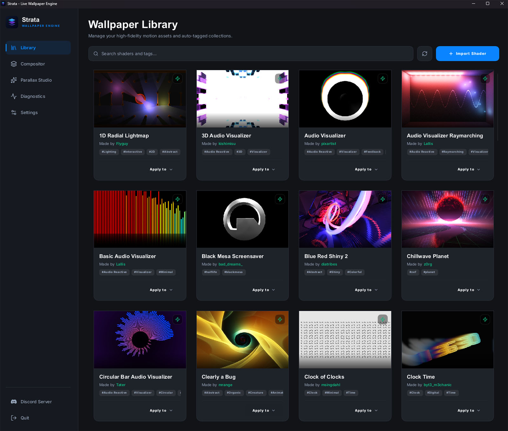
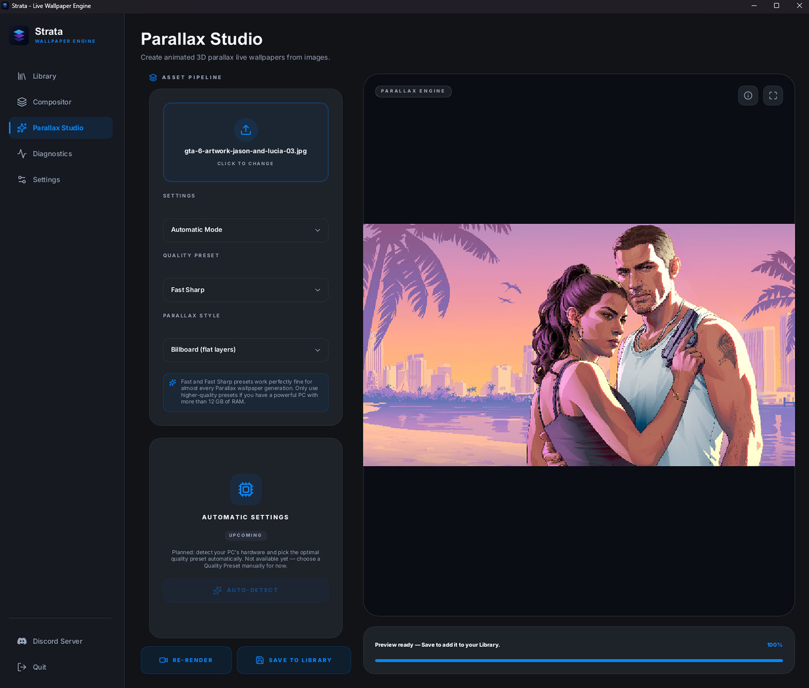

# Strata

A lightweight, hardware-accelerated live wallpaper and screensaver engine.

Strata runs animated, interactive wallpapers directly on your computer's graphics card. Unlike web-based wallpaper tools, it uses native graphics APIs (DirectX 12, Vulkan, and Metal) to reduce memory and CPU usage. The application includes a selection of shaders ported from Shadertoy.com.

## Features

* **Shadertoy compatibility:** Runs standard Shadertoy animations natively.
* **Native Screensaver Mode:** Use any live wallpaper as a native OS screensaver with configurable idle timeouts (1–60 minutes), optional password protection on resume, and automatic background wallpaper pausing.
* **Full-Screen Game Auto-Pause:** Automatically detects full-screen games, heavy applications, and video playback to pause wallpaper rendering instantly, freeing 100% GPU/CPU power for performance.
* **Audio-reactive wallpapers:** Wallpapers react to your system audio. The engine captures audio only when a reactive wallpaper is active.
* **Mouse interaction:** Wallpapers react to your cursor. You can apply this to all wallpapers, specific ones, or turn it off entirely.
* **Parallax Studio:** Converts 2D photos into 3D animated wallpapers that shift with your cursor using an on-device machine learning depth estimation pipeline.
* **Wallpaper import:** Import custom shaders exported from Shadertoy or video files (.mp4 and .webm). The application converts them and generates thumbnails automatically.
* **Multi-monitor support:** Assign different wallpapers to each monitor or stretch one wallpaper across all screens with adjustable resolution scaling per layer (0.25x to 1.0x).
* **Wallpaper library:** Browse, search, and filter your installed wallpapers.
* **Automatic updates:** Checks for engine and wallpaper library updates weekly.
* **Native interface:** A lightweight user interface with dark and light themes, a system tray icon, and live performance diagnostics.

## Project goals

* **Low resource usage:** Idle CPU usage stays under 1% while rendering two monitors at 60 FPS. The memory footprint is approximately 200MB.
* **On-demand execution:** Resources are only active when needed. Audio capture, thumbnail generation, and wallpaper windows shut down when not in use.

## Supported platforms

| Platform | Status |
| :--- | :--- |
| Windows | Supported |
| Linux | Planned (Wayland & X11 desktop integration) |
| Android | Planned (Native wallpaper service package) |
| macOS | Planned (Desktop spaces & menu bar integration) |

## To-do list

- [ ] **Daily wallpaper rotation:** Automatically change the active wallpaper each day from your library.
- [ ] **Parallax auto-detect:** Automatically select the optimal quality setting for Parallax Studio based on your hardware.
- [ ] **Translation support:** Add multiple language options to the interface.
- [ ] **Spotify integration:** Display track information and album art inside active wallpapers.

## License

Strata is free and open-source software, licensed under the GNU General Public License v3.0 or later (GPL-3.0-or-later). Anyone may use, study, modify, and redistribute Strata, but distributed forks or derivatives must remain open-source under the GPL. There are no paid tiers and no donations.

This repository contains only the engine code. Content is fetched at runtime:
* Shaders, thumbnails, and textures are downloaded from the [Strata-Library](https://github.com/BadassBaboon/Strata-Library) repository.
* Machine learning models are downloaded from Hugging Face.
* Parallax Studio presets are embedded in the engine.
